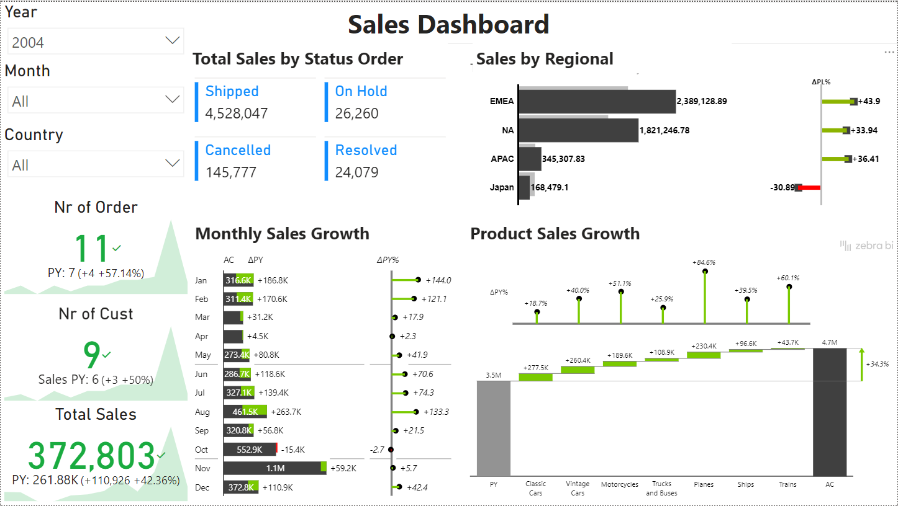

# Retail Sales Insights Dashboard

## Overview
This Power BI dashboard provides an in-depth analysis of sales performance using a sample retail sales dataset. The dashboard highlights key metrics, trends, and insights that help in understanding the company's sales over time.

---

## Features & Insights
- Total Sales Analysis (2003 - 2005) – View company-wide revenue trends
- Year-over-Year Sales Growth – Identify growth patterns across different categories
- Sales Breakdown by Month & Region – Drill down to specific time periods and geographical performance
- Product-wise Sales Performance – Compare different products based on revenue contribution
- Country-wise Sales Insights – Filter sales performance based on country and region

---

## Data Source
Dataset: [Sample Sales Data - Kaggle](https://www.kaggle.com/datasets/kyanyoga/sample-sales-data/data?select=sales_data_sample.csv)

- **License:** Creative Commons Attribution-Noncommercial-Share Alike 3.0 Unported

---

## Technical Details
- **Source File:** Microsoft Excel (.csv)
- **Visualization Tool:** Power BI

---

## Usage & Applications
- Retail Analytics – Track performance trends and sales fluctuations
- Customer Segmentation – Identify purchasing behaviors and regional preferences
- Business Decision Making – Gain insights into revenue drivers and product demand

---

## Preview

---

## How to Use
1. Open the Power BI file (`.pbix`).
2. Interact with filters to explore different sales insights.
3. Analyze key metrics for data-driven decisions.

---